# Keith Costa Designs
www.keithcostadesigns.com 

keithcostadesigns.com is a portfolio site for me. I am Keith Costa a 30 year old graphic designer and web developer, currently based in Philadelphia, PA. The site is built using mostly HTML and CSS with some JavaScript. 

## Home Page

The Landing page is composed of an image of me with my name, job title and two buttons leading to my two portfolios. The navbar gives more options on how to proceed (to About Me and Contact). When hovering over the graphic design and web developement buttons the background changes. The image of me is replaced by one of either graphic desing or web development work. 

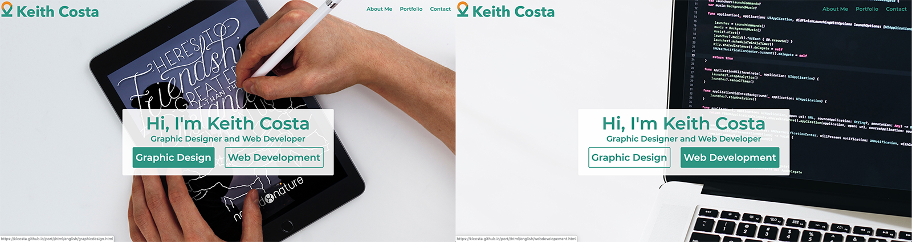

This effect is achieved using JavaScript byt usint the .mouseover() and . mouseout() event handlers. Two images are layered over eachoter. Mouseover() changes the src of the top  tag and fades it in. Mouseout() fades the top image out. Mouseover and mouseout are also used to display and delete the white box behind the text using css. 

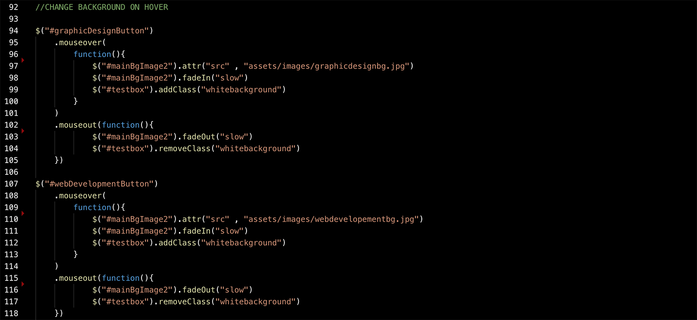

## Portfolio Pages

Both Portfolio pages have the same design. They have a header which includes the image used in the landing page. The title: Web Development or Graphic Design are displayed in orange in the bottom left of the header. The projects are displayed below represented by an image. Hovering above the image displays information in the form of a gray translucent box. These boxes include the project title, tools (Photoshop/HTML/JavaScript...) and the areas (front-end developement/branding/promotional materials...). A learn more button sits in the bottom left of the box. 

These boxes are responsive as the screen gets small they go down from 3 per line to 2 and then 1. In smaller screens the gray box appers at all times due to the inability to hover on phones and pads. 

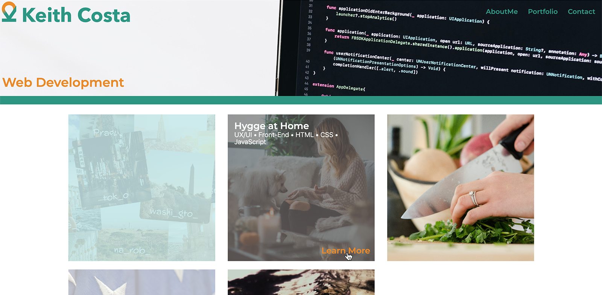

The hover effect is acheived using HTML and CSS, using :hover and display:block and display:none.

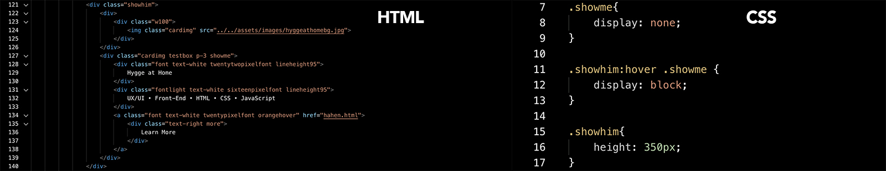

## Project Pages

All projects follow the same design. Firstly the header is increased compared to the portfolio pages. It has a max-height of 80%vh. This is so that on larger screens the first visual available to the user is the main image of the project and the title and subtitle, without overwhelming them with the text or images yet. On smaller screens the image size reduces to allow the user to see the full image. 

Scrolling down will reveal a brief description of the project. There is a minimum of two paragraphs for each. The first one describes the client and what he was looking for. The second describes the final product. Web Developement projects include a link to the final product. 

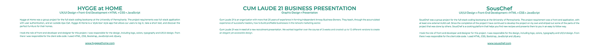

Below that a series of images shows the project. Graphic Designeb Development projects without a UX/UI design element to them project usual only have images. Web Development projects that include a UX/UI design element employ texts to futher describe the final product.

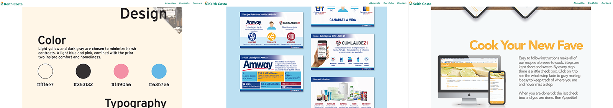

Finally the project page terminates in a series of buttons that lead you to the prior and next projects. these emply a similar hover technique used in the portfolio pages. 

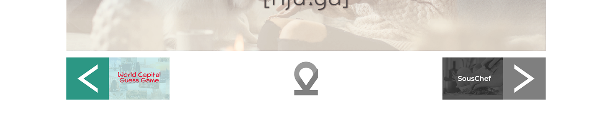

## About Me and Contact

About me and Contact are kept on the same HTML file. This page includes 3 distinct sections. The first About Me is just a brief description and photograph. 

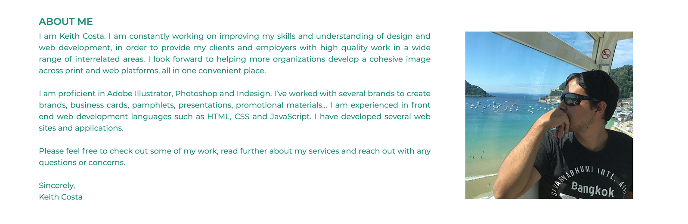

Below that there is a slider of reviews recieved from different clients. The reviews will change after a minute and 30 seconds. The user also has the option to circle through them using the right and left arrow buttons. 

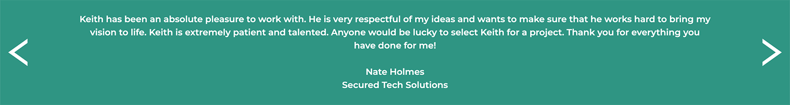

The slider is created in JavaScript. For it I used 3 arrays, 4 different functions a variable called count. The three arrays each contain one peice of information, the review, the client and the client's organization. One function the .html() handler to display the text. The second uses setTimeout() to change the text every 1.5 seconds. The third and fourth functions control the left and right arrows. They use clearTimeout() to reset the clock and use count to move forward or backward in the arrays. 

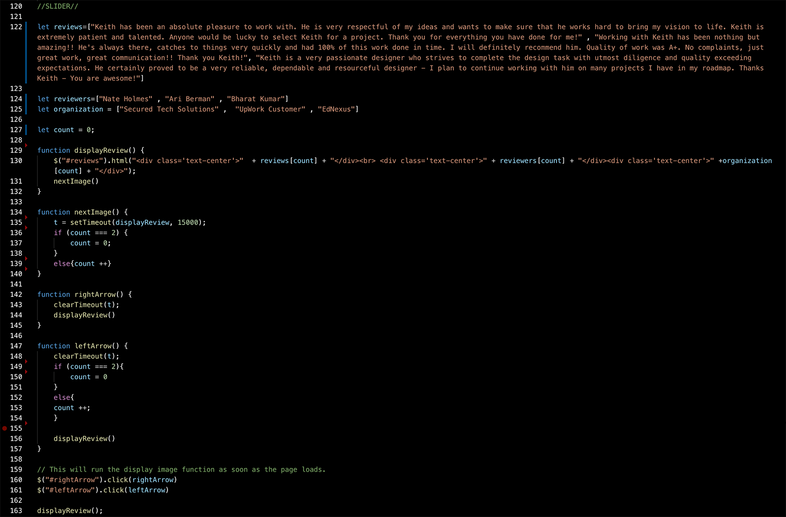

The final sections of this file is the contact form. It is a simple HTML form and uses firebase to store client requests. Underneath the form there are links to four different external social media sites. These are Behance, LinkedIn, GitHub and Instagram. 

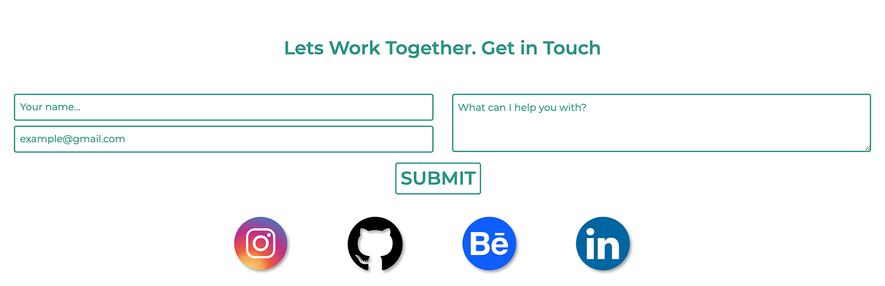

## NavBar and Footer

All pages except for the landing page have a navbar and footer. A white background is added to the navbar when scrolling bellow the top of the page or visiting the site on a smaller screen. Also on Smaller screens, Keith Costa dissappears from the left of the navbar and is replaced by just the icon and the menu is replaced by a hamburger menu. 

When hovering over the Portfolio button a new panel appears with the options Graphic Design and Web Development. This employs HTML and CSS using a similar :hover technique that I use the portfolio pages. 

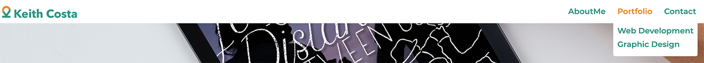

The footer includes a brief description of me and links to my social sites and different pages. On small screens on the latter two are displayed. 

